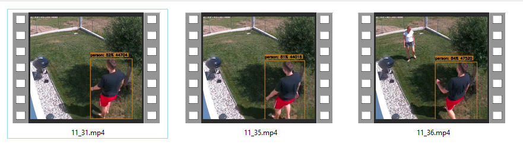

# Frigate to FTP clip backupper

[Frigate](https://github.com/blakeblackshear/frigate) is a very popular NVR with realtime object detection for ip cameras.

I had the need to backup my daily clips to a remote FTP server for disaster recovery purposes.

## Requirements

Besides the obvious (an ftp server), This project uses ffmpeg to compose mp4 file with the clip snapshot so to leverage file explorers preview on the media files as depicted below

Also this project requires Node.js. It has been developed to run with node v16.

## Configuring

Copy `.env.example` file to `.env` and setup the needed variables. You can optionally ditch  

## Installing

1. Clone the repo
2. run `npm install`
3. run `npm build`
4. run `npm install -g .` to install the cli command

# Usage

After configuring and installing you can launch it from shell via `frigate-backup` command.

Check that everything works and is configured as intended by launching it manually from cli.

You can then configure a cronjob to run the command at a specified time. 

**NOTE** if you don't install the command globally or you use `nvm` then you won't be able to directly call the command. Hence make use of `nvm_cron.sh`

